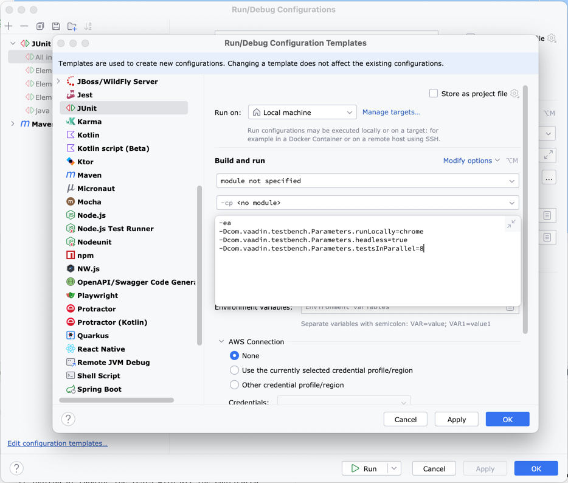

[](https://vaadin.com/directory/component/vaadin-testbench)

[](https://gitter.im/vaadin/testbench?utm_source=badge&utm_medium=badge&utm_campaign=pr-badge)

# Vaadin TestBench

Vaadin TestBench is both a unit testing tool and an integration testing tool.

The unit testing tool does not rely on a browser, so its tests run very fast. Because these tests do not run a browser, the browser's Javascript is not available.

The integration testing tool is build on Selenium and is used for automated user interface testing of web applications on multiple platforms and browsers.

Choosing testing tools optimized for Vaadin UI testing and supported by Vaadin provides you with the best integration and upward compatibility with the Vaadin framework. 

## Releases

Official releases of this add-on are available at [http://vaadin.com/addon/vaadin-testbench](https://github.com/vaadin/testbench-demo).

## Building TestBench

    git clone https://github.com/vaadin/testbench.git
    cd testbench
    mvn clean install

## Running Unit Tests

    mvn test

## Running Integration Tests

JUnit 4 tests should extend [`ParallelTest`](vaadin-testbench-core/src/main/java/com/vaadin/testbench/parallel/ParallelTest.java) if they are to be run in multiple browser configurations. For each browser configuration, a `WebDriver` is properly created with the desired browser configuration.


### Locally

An application server must be running in order to run the integration tests. The following examples use Jetty for that purpose.

#### Maven

The Maven project is configured to automatically start and stop Jetty when you run the integration tests.

```
    cd vaadin-testbench-integration-tests
    mvn -P validation verify
```
```
    cd vaadin-testbench-integration-tests-junit5
    mvn -P validation verify
```

If instead of running the tests with all the configured browsers you want to run with only one headless Chrome browser and limit the parallelism to 8, use

```
    cd vaadin-testbench-integration-tests
    mvn -P validation verify -Dcom.vaadin.testbench.Parameters.runLocally=chrome -Dcom.vaadin.testbench.Parameters.headless=true -Dcom.vaadin.testbench.Parameters.testsInParallel=8
```
```
    cd vaadin-testbench-integration-tests-junit5
    mvn -P validation verify -Dcom.vaadin.testbench.Parameters.runLocally=chrome -Dcom.vaadin.testbench.Parameters.headless=true -Dcom.vaadin.testbench.Parameters.testsInParallel=8
```

#### IntelliJ IDEA

Alternately, you can manually run Jetty (and leave it running) and then individually run integration tests or groups of integration tests within your IDE.

To run Jetty, you can either do it from the command line

```
    cd vaadin-testbench-integration-tests
    mvn jetty:run
```
*(Jetty will continue to run. When you want to stop it, press Ctrl-C on the command line where Jetty is running.)*

or you can create and run a Maven "Run/Debug Configuration" with `jetty:run` as the goal.

By default, all the configured browsers with a parallelism of 50 will run when you run your integration tests. If instead you want to run with only one headless Chrome browser and limit the parallelism to 8, edit the configuration template for JUnit and set its "VM options" to

```
-ea -Dcom.vaadin.testbench.Parameters.runLocally=chrome -Dcom.vaadin.testbench.Parameters.headless=true -Dcom.vaadin.testbench.Parameters.testsInParallel=8
```



Now when you run integration tests in the IDE, it will use the template defaults.

As this template change is global to all your projects, remember to restore the JUnit configuration template "VM options" when you no longer need them.

### Remotely

Because integration tests can take a long time to run as each test launches the application in multiple browsers, you can configure your tests to run in Sauce Labs. See details at [SauceLabs](https://wiki.saucelabs.com) and [GitHub](https://github.com/vaadin/testbench-demo).

## Issue tracking & Contributions

Please report bugs and submit feature requests as [GitHub issues](https://github.com/vaadin/testbench/issues). Contributions in the form of pull requests are more than welcome.

## License

This add-on is distributed under [Vaadin Commercial License and Service Terms](https://vaadin.com/commercial-license-and-service-terms).
